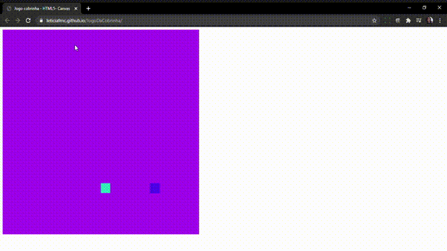

### Jogo da Cobrinha 

O Jogo da Cobrinha  foi desenvolvido com HTML5 Canvas e Js com o objetivo de demostrar meu aprendizado.

### Instalação 

Clone este repositório usando git clone https://github.com/Leticiafrnc/JogoDaCobrinha.git ou clique em Code/Download ZIP.
Clique no arquivo "index.HTML" e veja a aplicação.

